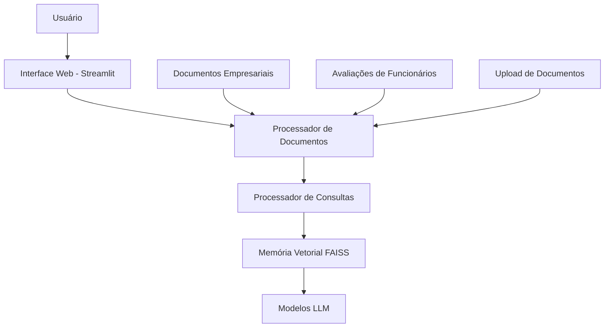

# Sistema RAG Empresarial

Sistema de Recuperação Aumentada por Geração (RAG) para gerenciamento de documentos empresariais e avaliações de funcionários.

## Visão Geral

Este projeto transforma o chatbot com memória hierárquica existente em um sistema RAG completo para empresas, permitindo:

- Upload e processamento de documentos empresariais (PDF, DOCX, TXT)
- Gestão de avaliações de funcionários
- Busca semântica em documentos e avaliações
- Controle de acesso baseado em funções
- Interface web intuitiva

## Arquitetura



## Funcionalidades

### 1. Gestão de Documentos
- Upload de documentos em formatos PDF, DOCX e TXT
- Processamento automático com divisão em chunks
- Extração de metadados (título, departamento, tipo, etc.)
- Indexação em armazenamento vetorial FAISS
- Busca semântica em documentos

### 2. Avaliações de Funcionários
- Registro de avaliações de desempenho
- Armazenamento de metas e feedbacks
- Integração com sistema de busca semântica
- Cálculo de métricas de desempenho

### 3. Busca Semântica
- Consultas em linguagem natural
- Recuperação de documentos relevantes
- Geração de respostas com base em documentos recuperados
- Citações de fontes

### 4. Controle de Acesso
- Autenticação de usuários
- Perfis: administrador, gerente e funcionário
- Controle de acesso baseado em departamento
- Proteção de dados sensíveis

## Tecnologias

- **Python 3.9+**
- **Streamlit** - Interface web
- **LangChain** - Orquestração de LLMs
- **FAISS** - Armazenamento vetorial
- **OpenAI** - Modelos de linguagem e embeddings
- **Google Gemini** - Modelos de linguagem alternativos
- **Anthropic Claude** - Modelos de linguagem alternativos

## Estrutura do Projeto

```
.
├── README_RAG.md           # Documentação do sistema RAG
├── rag_app.py              # Interface Streamlit principal
├── rag_components/         # Componentes do sistema RAG
│   ├── rag_agent.py        # Agente RAG principal
│   ├── document_processor.py # Processamento de documentos
│   ├── query_processor.py  # Processamento de consultas
│   ├── evaluation_manager.py # Gestão de avaliações
│   ├── faiss_manager.py    # Gerenciamento do FAISS
│   ├── auth.py             # Autenticação e controle de acesso
│   └── utils.py            # Funções utilitárias
├── docs/                   # Diretório de documentos
│   ├── company/            # Documentos empresariais
│   ├── evaluations/        # Avaliações de funcionários
│   └── processed/          # Documentos processados
├── database/               # Esquema do banco de dados
│   └── schema.sql
├── requirements.txt        # Dependências do projeto
└── .streamlit/            # Configurações do Streamlit
```

## Instalação

1. Clone o repositório:
```bash
git clone <repositório>
cd long-memory-character-chat
```

2. Crie um ambiente virtual:
```bash
python -m venv venv
source venv/bin/activate  # Linux/Mac
# ou
venv\Scripts\activate     # Windows
```

3. Instale as dependências:
```bash
pip install -r requirements.txt
```

4. Configure as variáveis de ambiente:

Opção 1 - Usando variáveis de ambiente diretamente:
```bash
export OPENAI_API_KEY="sua-chave-openai"
export GOOGLE_API_KEY="sua-chave-google"  # opcional
export ANTHROPIC_API_KEY="sua-chave-anthropic"  # opcional
```

Opção 2 - Usando arquivo .env (recomendado):

Copie o arquivo `.env.example` para `.env` e edite com suas chaves:
```bash
cp .env.example .env
```

Edite o arquivo `.env` e adicione suas chaves de API:
```env
# Chaves de API para modelos de linguagem
OPENAI_API_KEY=sua_chave_aqui
GOOGLE_API_KEY=sua_chave_aqui
ANTHROPIC_API_KEY=sua_chave_aqui
TOGETHER_API_KEY=sua_chave_aqui
LAMBDA_API_KEY=sua_chave_aqui

# Configurações de segurança
CHAT_NSFW_PASSWORD=sua_senha_aqui
ADMIN_PASSWORD=sua_senha_admin_aqui
```

5. Execute a aplicação:
```bash
streamlit run rag_app.py
```

## Uso

1. Acesse a aplicação através do navegador (geralmente em `http://localhost:8501`)
2. Faça login com as credenciais padrão:
   - Usuário: `admin`
   - Senha: `admin123` (pode ser alterada nas variáveis de ambiente)
3. Navegue pelas abas para:
   - Upload de documentos (administradores e gerentes)
   - Gestão de documentos (administradores e gerentes)
   - Avaliações de funcionários (administradores e gerentes)
   - Busca semântica (todos os usuários)

## Segurança

- Todos os usuários devem se autenticar
- Controle de acesso baseado em funções
- Proteção de dados sensíveis
- Logs de acesso a documentos

## Próximos Passos

- Integração com banco de dados para persistência
- Sistema de notificações
- Relatórios de desempenho
- Exportação de dados
- Integração com sistemas de armazenamento em nuvem

## Contribuição

Contribuições são bem-vindas! Por favor, leia o guia de contribuição antes de enviar pull requests.

## Licença

Este projeto é licenciado sob a licença MIT - veja o arquivo LICENSE para detalhes.