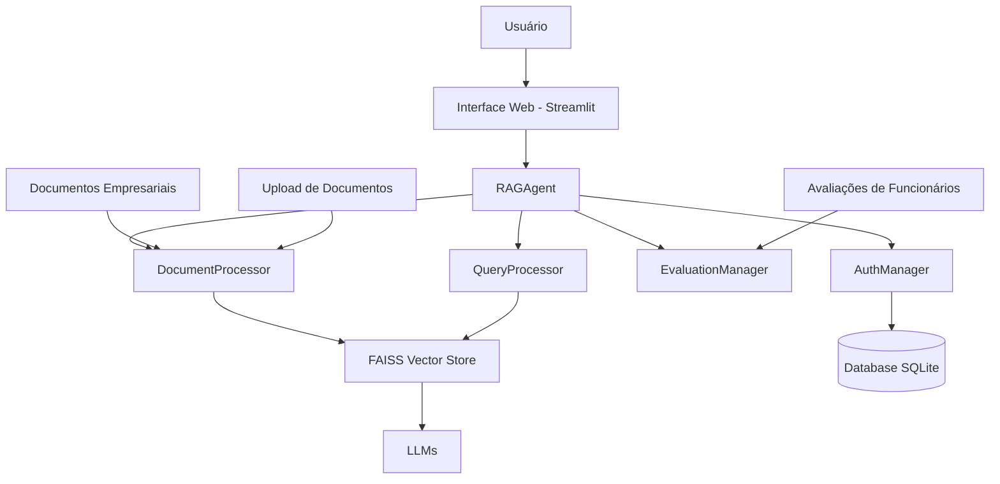

# Sistema RAG Empresarial - Documentação Completa

## Visão Geral do Projeto

O **Sistema RAG Empresarial** é uma plataforma avançada de Recuperação Aumentada por Geração (RAG) que combina as capacidades de um chatbot com memória de longo prazo e um sistema de gestão de documentos empresariais. O projeto evoluiu de um chatbot de role-playing para uma solução empresarial completa que atende tanto entusiastas de IA quanto organizações que precisam gerenciar documentos e avaliações de funcionários com busca semântica.

### Problemas Resolvidos

O sistema resolve diversos problemas comuns em plataformas de conversação e gestão documental:

1. **Memória Curta em Chatbots**: A maioria dos chatbots esquece contextos anteriores rapidamente, perdendo informações importantes da conversa.
2. **Degradação da Personalidade**: Personagens virtuais tendem a perder sua personalidade única ao longo de conversas longas.
3. **Personagens Estáticos**: Dificuldade em alterar dinamicamente descrições de personagens, localizações ou cenários.
4. **Gestão Ineficiente de Documentos Empresariais**: Falta de sistemas eficazes para busca semântica em documentos corporativos.
5. **Avaliações de Funcionários Desconectadas**: Dificuldade em acessar e consultar histórico de avaliações de desempenho.

## Visão de Negócio

### Benefícios para Organizações

1. **Gestão Inteligente de Conhecimento**
   - Upload e processamento automático de documentos em formatos PDF, DOCX e TXT
   - Busca semântica que permite encontrar informações usando linguagem natural
   - Indexação eficiente com FAISS para recuperação rápida

2. **Avaliação de Desempenho Integrada**
   - Registro estruturado de avaliações de funcionários
   - Consulta semântica ao histórico de desempenho
   - Integração com documentos corporativos para contexto completo

3. **Controle de Acesso Baseado em Funções**
   - Perfis de usuário: administrador, gerente e funcionário
   - Proteção de dados sensíveis
   - Auditoria de acesso a documentos

4. **Experiência do Usuário Aprimorada**
   - Interface web intuitiva com Streamlit
   - Suporte a múltiplos modelos de linguagem (GPT, Gemini, Claude)
   - Respostas contextualizadas com citações de fontes

### Casos de Uso

1. **Departamento de Recursos Humanos**
   - Gestão de documentos de políticas internas
   - Acesso rápido a manuais e procedimentos
   - Consulta a histórico de avaliações de funcionários

2. **Departamentos Operacionais**
   - Armazenamento de relatórios e documentos técnicos
   - Busca semântica em bases de conhecimento
   - Compartilhamento seguro de informações entre equipes

3. **Gestão de Conhecimento Corporativo**
   - Centralização de documentos empresariais
   - Preservação do conhecimento organizacional
   - Redução do tempo de busca por informações

## Visão Técnica

### Arquitetura do Sistema



### Componentes Principais

#### RAGAgent
O componente central do sistema, responsável por orquestrar todas as operações:

```python
class RAGAgent:
    def __init__(self, model="gpt-3.5-turbo", embedding_model="text-embedding-3-small"):
        self.set_model(model)
        self.embeddings = OpenAIEmbeddings(model=embedding_model)
        self.document_processor = DocumentProcessor(embedding_model)
        self.evaluation_manager = EvaluationManager()
        self.vector_store = None
```

#### DocumentProcessor
Responsável pelo processamento de documentos:

- Carregamento de documentos em formatos PDF, DOCX e TXT
- Divisão em chunks com sobreposição (1000 tokens com 200 de sobreposição)
- Extração de metadados
- Indexação em armazenamento vetorial FAISS

#### QueryProcessor
Processa consultas dos usuários:

- Busca semântica em documentos indexados
- Geração de respostas baseadas em contexto recuperado
- Formatação de prompts para modelos de linguagem

#### EvaluationManager
Gerencia avaliações de funcionários:

- Registro estruturado de avaliações
- Cálculo de métricas de desempenho
- Integração com sistema de busca semântica

#### AuthManager
Implementa controle de acesso:

- Autenticação de usuários
- Perfis baseados em funções
- Proteção de dados sensíveis

### Tecnologias Utilizadas

- **Python 3.9+**: Linguagem principal do projeto
- **Streamlit**: Interface web responsiva
- **LangChain**: Orquestração de LLMs e memória
- **FAISS**: Armazenamento vetorial para busca semântica
- **OpenAI/Gemini/Anthropic**: Modelos de linguagem e embeddings
- **SQLite**: Banco de dados para usuários e metadados

### Estrutura de Diretórios

```
.
├── database/               # Esquema e dados do banco
│   └── schema.sql
├── docs/                   # Documentos do projeto
│   ├── company/            # Documentos empresariais
│   ├── evaluations/        # Avaliações de funcionários
│   └── processed/          # Documentos processados
├── rag_components/         # Componentes do sistema RAG
│   ├── rag_agent.py        # Agente RAG principal
│   ├── document_processor.py # Processamento de documentos
│   ├── query_processor.py  # Processamento de consultas
│   ├── evaluation_manager.py # Gestão de avaliações
│   ├── auth.py             # Autenticação e controle de acesso
│   └── utils.py            # Funções utilitárias
├── rag_app.py              # Interface Streamlit principal
├── requirements.txt        # Dependências do projeto
└── README_RAG.md           # Documentação técnica
```

### Funcionalidades Técnicas

#### Memória Hierárquica
O sistema implementa três níveis de memória:

1. **Memória de Curto Prazo**: Janela de chat com mensagens recentes
2. **Memória de Médio Prazo**: Rascunho atualizado dinamicamente
3. **Memória de Longo Prazo**: Banco vetorial FAISS com resumos de conversas

#### Processamento de Documentos
- Suporte a múltiplos formatos (PDF, DOCX, TXT)
- Divisão automática em chunks otimizados
- Extração de metadados (título, departamento, tipo)
- Indexação em FAISS para busca semântica

#### Busca Semântica
- Consultas em linguagem natural
- Recuperação de documentos relevantes
- Geração de respostas contextualizadas
- Citações de fontes originais

#### Controle de Acesso
- Autenticação de usuários
- Perfis: administrador, gerente, funcionário
- Controle baseado em departamento
- Logs de acesso a documentos

## Instalação e Configuração

### Requisitos
- Python 3.9+
- Chaves de API para serviços de IA (OpenAI, Google, Anthropic)

### Passos de Instalação

1. Clone o repositório:
```bash
git clone <repositório>
cd long-memory-character-chat
```

2. Crie um ambiente virtual:
```bash
python -m venv venv
source venv/bin/activate  # Linux/Mac
# ou
venv\Scripts\activate     # Windows
```

3. Instale as dependências:
```bash
pip install -r requirements.txt
```

4. Configure as variáveis de ambiente:
```bash
export OPENAI_API_KEY="sua-chave-openai"
export GOOGLE_API_KEY="sua-chave-google"  # opcional
export ANTHROPIC_API_KEY="sua-chave-anthropic"  # opcional
```

5. Execute a aplicação:
```bash
streamlit run rag_app.py
```

## Uso do Sistema

1. Acesse a aplicação através do navegador (geralmente em `http://localhost:8501`)
2. Faça login com as credenciais padrão:
   - Usuário: `admin`
   - Senha: `admin123` (pode ser alterada nas variáveis de ambiente)
3. Navegue pelas abas para:
   - Upload de documentos (administradores e gerentes)
   - Gestão de documentos (administradores e gerentes)
   - Avaliações de funcionários (administradores e gerentes)
   - Busca semântica (todos os usuários)

## Segurança

- Todos os usuários devem se autenticar
- Controle de acesso baseado em funções
- Proteção de dados sensíveis
- Logs de acesso a documentos

## Próximos Passos

- Integração com banco de dados para persistência completa
- Sistema de notificações
- Relatórios de desempenho
- Exportação de dados
- Integração com sistemas de armazenamento em nuvem

## Contribuição

Contribuições são bem-vindas! Por favor, leia o guia de contribuição antes de enviar pull requests.

## Licença

Este projeto é licenciado sob a licença MIT - veja o arquivo LICENSE para detalhes.