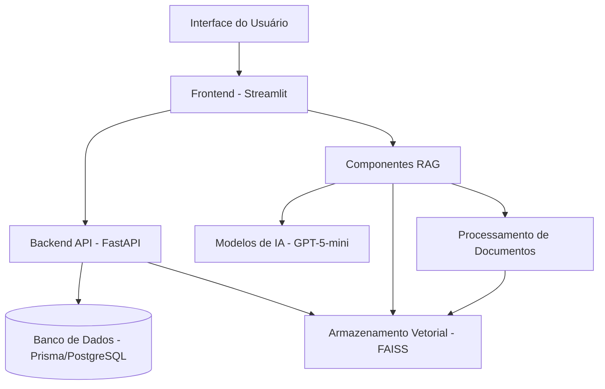

# Modificação 01: Arquitetura do Sistema Second Brain

## Data
06/09/2025

## Descrição
Implementação da arquitetura do sistema Second Brain com base no design document fornecido. Esta modificação define a estrutura geral do sistema que transforma o projeto existente em um sistema de gerenciamento de conhecimento pessoal.

## Componentes da Arquitetura

### 1. Frontend (Streamlit)
- Interface principal para interação do usuário
- Funcionalidade de upload de documentos
- Interface de consulta para perguntas em linguagem natural
- Exibição de resultados com documentos fonte
- Gerenciamento de autenticação e sessão do usuário

### 2. Backend API (FastAPI)
- API RESTful para comunicação com o frontend
- Autenticação e autorização de usuários
- Gerenciamento de modelos
- Operações de banco de dados através do Prisma ORM

### 3. Componentes RAG
- Processamento e indexação de documentos
- Capacidades de busca semântica
- Processamento de consultas com recuperação de contexto
- Gerenciamento de armazenamento vetorial com FAISS

### 4. Banco de Dados
- PostgreSQL com Prisma ORM
- Gerenciamento de usuários
- Configuração de modelos
- Armazenamento de metadados

### 5. Armazenamento Vetorial
- FAISS para indexação vetorial e busca por similaridade
- Armazenamento persistente de embeddings de documentos
- Recuperação rápida de conteúdo relevante

## Arquitetura Multi-tenant com Workspaces

O sistema implementa uma arquitetura multi-tenant com isolamento de workspaces:

- Organizações (tenants) com isolamento completo de dados
- Workspaces dentro de organizações para colaboração em equipe
- Controle de acesso baseado em papéis nos níveis de organização e workspace
- Isolamento de armazenamento de arquivos usando convenções de nomenclatura baseadas em tenant/workspace
- Rastreamento de custos e limitação de taxa por tenant

## Arquitetura em Camadas

O Sistema Second Brain segue uma arquitetura em camadas com separação clara entre frontend, backend e componentes de IA:

