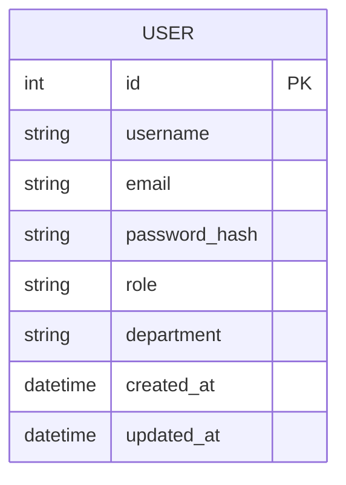
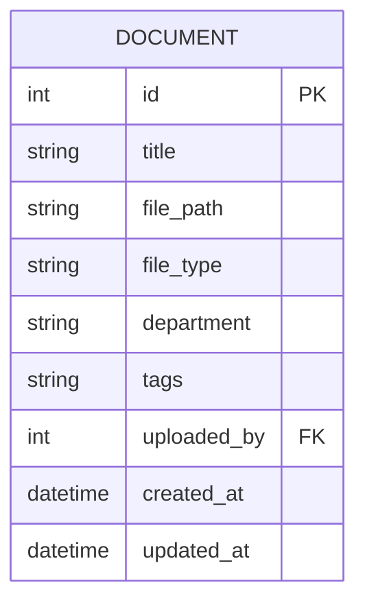
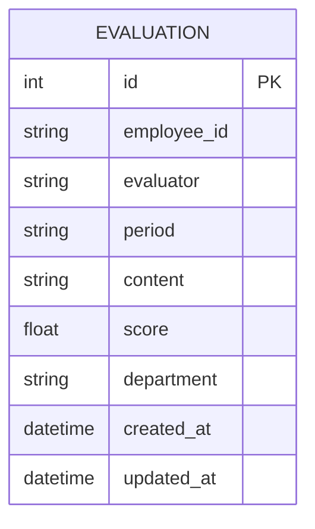
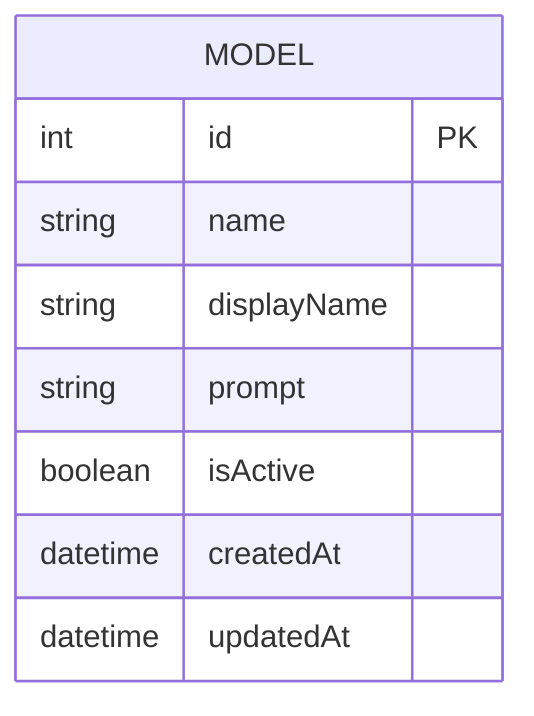

# Modificação 02: Modelos de Dados do Sistema Second Brain

## Data
06/09/2025

## Descrição
Definição dos modelos de dados para o sistema Second Brain com base no design document fornecido. Esta modificação estabelece as estruturas de dados necessárias para suportar as funcionalidades do sistema de gerenciamento de conhecimento pessoal.

## Modelos de Dados

### 1. Modelo de Usuário
Representa os usuários do sistema com informações de autenticação e autorização.

### 2. Modelo de Documento
Representa os documentos armazenados no sistema com metadados associados.

### 3. Modelo de Avaliação
Representa as avaliações de membros da equipe armazenadas no sistema.

### 4. Modelo de Configuração
Representa a configuração dos modelos de linguagem disponíveis no sistema.

## Relacionamentos entre Modelos

Os modelos de dados estão interconectados para fornecer uma experiência integrada:

- Usuários podem fazer upload de documentos
- Documentos são associados aos usuários que os fizeram upload
- Avaliações são vinculadas a funcionários e avaliadores (também usuários)
- Todos os modelos são organizados por workspaces e organizações para isolamento multi-tenant

## Considerações de Segurança

- Senhas são armazenadas com hash usando bcrypt
- Informações sensíveis são protegidas por criptografia
- Controle de acesso baseado em papéis é implementado em todos os níveis
- Isolamento de dados entre tenants é garantido através de relacionamentos de banco de dados