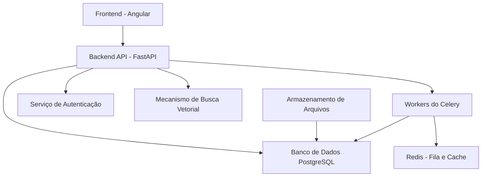

# Plano de Desenvolvimento - Sistema RAG Empresarial v2.0 (Estratégia Vertical) {#plano-de-desenvolvimento---sistema-rag-empresarial-v2.0-estratégia-vertical}

## Visão Geral

Este documento detalha o plano de implementação para transformar o
projeto *long-memory-character-chat* em um sistema empresarial completo
de RAG (Retrieval-Augmented Generation) conforme especificado no PRD.

**Filosofia de Entrega:** Adotamos uma estratégia de desenvolvimento
vertical e enxuta. O objetivo é construir e validar uma "fatia fina" e
funcional do sistema de ponta a ponta nas primeiras 8 semanas. Isso nos
permite obter feedback real sobre a funcionalidade principal (upload e
busca) rapidamente, mitigando riscos e garantindo que estamos
construindo o produto certo antes de escalar a complexidade com
funcionalidades empresariais.

## Stack Tecnológica

- **Backend**: Python com FastAPI

- **Frontend**: Angular v20 com TypeScript

- **Banco de Dados**: PostgreSQL com Prisma ORM

- **Autenticação**: Autenticação baseada em JWT com Supabase

- **Armazenamento Vetorial**: Extensão pgvector no PostgreSQL

- **Processamento de Tarefas**: Celery com Redis

- **Cache**: Redis

- **Armazenamento de Arquivos**: Sistema de arquivos local ou
  > armazenamento em nuvem (AWS S3, Google Cloud Storage)

## Arquitetura do Sistema

## Tarefas de Implementação

### Fase 1: MVP Core - O Primeiro Valor Tangível (Semanas 1-8)

**Objetivo:** Entregar um sistema funcional de ponta a ponta onde um
usuário pode se registrar, fazer upload de um documento e obter
respostas inteligentes dele. Validar o ciclo completo do RAG.

#### **Sprint 0: A Fundação (Semanas 1-2)**

***Foco: Backend. Ambiente robusto e autenticação mínima.***

1.  **Configuração da API (Backend)**

    - [ ] Configurar a estrutura do projeto FastAPI

    - [ ] Configurar conexão com PostgreSQL usando Prisma ORM

    - [ ] Criar schema Prisma **mínimo** para Users, Organizations,
      > Workspaces, Documents, DocumentChunks

    - [ ] Implementar migrações de banco de dados usando prisma
      > migrate

    - [ ] Configurar extensão pgvector

2.  **Autenticação Mínima (Backend)**

    - [ ] Implementar autenticação JWT personalizada (sem RBAC
      > complexo inicialmente)

    - [ ] Criar endpoints de registro e login de usuários

    - [ ] Implementar hashing de senhas e armazenamento seguro

#### **Sprint 1: O Caminho do Documento (Semanas 3-4)**

***Foco: Backend. Ingestão e processamento de documentos.***

1.  **Upload e Armazenamento (Backend)**

    - [ ] Implementar endpoint de upload de documentos associado a um
      > workspace

    - [ ] Integrar sistema de arquivos local ou nuvem (S3/GCS)

2.  **Processamento Assíncrono (Backend)**

    - [ ] Configurar Celery com broker Redis

    - [ ] Criar tarefa Celery para extração de texto (PDF, DOCX, TXT)
      > e segmentação de documentos

3.  **Geração de Embeddings (Backend)**

    - [ ] Na tarefa Celery, integrar com API de embeddings da OpenAI

    - [ ] Armazenar embeddings no pgvector

#### **Sprint 2: A Primeira Resposta Inteligente (Semanas 5-6)**

***Foco: Backend. Fechar o ciclo do RAG.***

1.  **API de Busca Mínima (Backend)**

    - [ ] Criar endpoint de busca (/query) com contexto de workspace

    - [ ] Implementar lógica de busca **semântica** (apenas vetorial
      > inicialmente)

    - [ ] Construir o prompt com o contexto recuperado e gerar
      > resposta via LLM

2.  **Gestão de Conversas Mínima (Backend)**

    - [ ] Implementar criação de conversas e armazenamento de
      > histórico de mensagens

#### **Sprint 3: A Interface Mínima Viável (Semanas 7-8)**

***Foco: Frontend. Construir sobre uma API estável.***

1.  **Configuração e Autenticação (Frontend)**

    - [ ] Inicializar projeto Angular v20

    - [ ] Criar páginas de login e registro

    - [ ] Implementar serviço de autenticação com JWT e guards de
      > rotas

2.  **Fluxo de Documento e Chat (Frontend)**

    - [ ] Criar interface **única e simples** para:

      - [ ] Upload de documentos (consumindo a API)

      - [ ] Listagem simples de documentos com status de processamento

      - [ ] Interface de chat para enviar perguntas e exibir respostas
        > (consumindo a API de busca)

### Fase 2: Fortalecimento Enterprise (Semanas 9-13)

**Objetivo:** Evoluir o MVP para uma solução multi-tenant robusta,
adicionando controle de acesso granular e painéis de gestão.

1.  **Controle de Acesso Avançado (Backend)**

    - [ ] Implementar controle de acesso baseado em funções (RBAC)
      > completo (super_admin, tenant_admin, etc.)

    - [ ] Implementar funções específicas por workspace (admin,
      > member, viewer)

2.  **Gestão de Organizações e Workspaces (Backend & Frontend)**

    - [ ] Criar endpoints CRUD completos para Organizações e
      > Workspaces

    - [ ] Desenvolver interface para seleção de organização/workspace

    - [ ] Implementar telas de gerenciamento de usuários e atribuição
      > de papéis

3.  **Interface de Gestão de Documentos Completa (Frontend)**

    - [ ] Adicionar capacidades de filtragem, busca e visualização
      > detalhada de documentos

    - [ ] Implementar notificações para conclusão de processamento

### Fase 3: Otimização e Monetização (Semanas 14-17)

**Objetivo:** Implementar funcionalidades de controle de custos, rate
limiting e busca avançada para tornar o produto comercialmente viável.

1.  **Busca Híbrida (Backend)**

    - [ ] Adicionar busca por texto completo (full-text search) do
      > PostgreSQL

    - [ ] Criar algoritmo de ranqueamento para busca híbrida

    - [ ] Atualizar API de busca para suportar modos (semântica,
      > palavra-chave, híbrida)

2.  **Rastreamento de Custos (Backend & Frontend)**

    - [ ] Implementar cálculo e armazenamento de custos de API

    - [ ] Criar endpoints para monitoramento de custos

    - [ ] Desenvolver o Dashboard de Custos para visualização e
      > alertas

3.  **Limitação de Taxa (Backend)**

    - [ ] Implementar rate limiting por usuário e organização

    - [ ] Criar endpoints para configuração de limites

4.  **Interface de Busca Avançada (Frontend)**

    - [ ] Implementar seleção de modo de busca e filtros avançados na
      > UI

    - [ ] Exibir resultados com pontuação de relevância e citação de
      > fontes

### Fase 4: Administração e Features Avançadas (Semanas 18-21)

**Objetivo:** Construir painéis de administração especializados e
adicionar funcionalidades de valor agregado como o sistema de
avaliações.

1.  **Painéis de Administração (Backend & Frontend)**

    - [ ] Implementar dashboards e funcionalidades para Super Admin,
      > Tenant Admin e Workspace Admin

    - [ ] Adicionar relatórios de uso e logs de auditoria

2.  **Sistema de Avaliações (Backend & Frontend)**

    - [ ] Criar modelo de dados e operações CRUD para avaliações

    - [ ] Desenvolver módulo de avaliações na interface com relatórios
      > e análises

3.  **Conformidade de Dados (Backend)**

    - [ ] Implementar tratamento de solicitações de exclusão de dados
      > (GDPR/LGPD)

    - [ ] Implementar políticas de retenção de dados

### Fase 5: Produção e Monitoramento (Semanas 22-24)

**Objetivo:** Otimizar o sistema para performance, fortalecer a
segurança e implantar em um ambiente de produção monitorado.

1.  **Otimização de Performance (Backend & Frontend)**

    - [ ] Implementar estratégias de cache com Redis

    - [ ] Otimizar consultas de banco de dados e builds de produção

    - [ ] Implementar pooling de conexões e carregamento preguiçoso
      > (lazy loading)

2.  **Fortalecimento de Segurança (Backend)**

    - [ ] Implementar validação de entrada, CORS, cabeçalhos de
      > segurança

    - [ ] Configurar varredura de segurança no CI/CD

3.  **Implantação e CI/CD (DevOps)**

    - [ ] Criar scripts de implantação, configurações de ambiente e
      > health checks

    - [ ] Configurar monitoramento, logging e alertas para produção

## Schema do Banco de Dados

O schema do banco de dados será implementado usando Prisma ORM com os
seguintes modelos principais:

1.  **Organizations** - Gerenciamento de tenants

2.  **Workspaces** - Ambientes de trabalho isolados

3.  **Users** - Contas de usuários com permissões

4.  **Documents** - Arquivos enviados com metadados

5.  **DocumentChunks** - Segmentos de texto com embeddings

6.  **Conversations** - Conversas de chat com contexto

7.  **ConversationMessages** - Mensagens individuais

8.  **EmbeddingModels** - Configuração para modelos de embedding

9.  **CostTracking** - Monitoramento de uso e custos

10. **RateLimits** - Limitação de taxa

11. **Evaluations** - Avaliações de desempenho

12. **AuditLogs** - Logs de conformidade e segurança

## Considerações de Segurança

1.  **Autenticação e Autorização**

    - Autenticação baseada em JWT com PostgreSQL

    - Controle de acesso baseado em funções no nível da API

    - Segurança em nível de linha no banco de dados

    - Tratamento e armazenamento seguro de senhas

2.  **Proteção de Dados**

    - Criptografia em repouso para dados sensíveis

    - Criptografia TLS para dados em trânsito

    - Armazenamento seguro de arquivos com controles de acesso

    - Auditorias de segurança regulares e testes de penetração

3.  **Conformidade**

    - Conformidade com GDPR/LGPD com capacidades de exclusão de dados

    - Logs de auditoria para todas as ações do usuário

    - Políticas de retenção de dados

    - Princípios de privacidade por design

## Otimização de Performance

1.  **Otimização do Banco de Dados**

    - Indexação adequada para operações de busca e filtragem

    - Pooling de conexões para conexões de banco de dados

    - Otimização de consultas para grandes conjuntos de dados

    - Estratégias de cache para dados acessados com frequência

2.  **Performance da API**

    - Compressão de resposta para payloads grandes

    - Paginação para grandes conjuntos de resultados

    - Processamento assíncrono para tarefas de longa duração

    - Balanceamento de carga para alta disponibilidade

3.  **Performance do Frontend**

    - Carregamento preguiçoso para componentes não críticos

    - Divisão de código para módulos de recursos

    - Otimização e cache de imagens

    - Gerenciamento eficiente de estado com NgRx

## Estratégia de Testes

1.  **Testes Unitários**

    - Testes de endpoints da API backend

    - Testes da camada de serviço

    - Testes de consultas de banco de dados

    - Testes de componentes frontend

2.  **Testes de Integração**

    - Testes de integração da API

    - Testes de integração do banco de dados

    - Testes de fluxo de autenticação

    - Testes de integração de serviços de terceiros

3.  **Testes de Ponta a Ponta**

    - Testes de jornada do usuário

    - Testes de compatibilidade entre navegadores

    - Testes de performance

    - Testes de segurança

## Implantação e CI/CD

1.  **Integração Contínua**

    - Verificações automatizadas de qualidade de código

    - Testes unitários e de integração

    - Varredura de segurança

    - Builds automatizados

2.  **Implantação Contínua**

    - Implantações específicas por ambiente

    - Estratégia de implantação blue-green

    - Capacidades de rollback

    - Verificações de saúde automatizadas

3.  **Infraestrutura**

    - Containerização com Docker

    - Orquestração com Kubernetes ou similar

    - Balanceamento de carga e auto-scaling

    - Sistemas de monitoramento e alertas

## Estratégia de Migração

1.  **Migração de Dados**

    - Migração de schema usando Prisma migrate

    - Scripts de transferência de dados existentes

    - Processos de validação e verificação

    - Procedimentos de rollback

2.  **Migração de Usuários**

    - Migração de contas de usuários

    - Mapeamento de permissões e funções

    - Plano de notificação e comunicação

    - Suporte durante o período de transição

## Mitigação de Riscos

1.  **Riscos Técnicos**

    - Performance do pgvector: Benchmarks prévios + fallback para
      > Pinecone

    - Complexidade do multi-workspace: Prototipação prévia + testes
      > extensivos

    - Migração de dados: Scripts de migração + ambiente de teste

    - Busca híbrida performance: Índices otimizados + cache agressivo

2.  **Riscos de Negócio**

    - **Custo de APIs escala descontroladamente**: **Rate limiting +
      > dashboard custos + alertas**

    - Resistência à mudança: Treinamento + rollout gradual

    - Downtime na migração: Migração blue-green + rollback plan

    - Budget overrun: Controle semanal + escopo flexível

3.  **Riscos Financeiros**

    - Custos OpenAI excedem orçamento: Limites por tenant + cache
      > agressivo + alertas

    - Usuários abusam do sistema: Rate limiting rigoroso + monitoramento

    - Crescimento de uso imprevisível: Dashboard custos + alertas
      > automáticos

## Critérios de Sucesso

1.  **Métricas de Performance**

    - Tempo de resposta: < 2s para 95% das consultas

    - Busca híbrida: 90%+ de satisfação vs busca apenas semântica

    - Throughput: 1000+ usuários simultâneos

    - Disponibilidade: 99.9% uptime

    - Processamento: 50MB document em < 5min

2.  **Métricas de Negócio**

    - Adoção: 80% dos usuários ativos em 30 dias pós-deploy

    - Satisfação: NPS > 70

    - Produtividade: 60% redução no tempo de busca por informações

    - Segurança: Zero vazamentos de dados entre workspaces

    - Controle de custos: 100% dos tenants com visibilidade de custos

    - Onboarding: 90% dos novos Tenant Admins completam wizard inicial

3.  **Métricas Técnicas**

    - Cobertura de testes: > 90%

    - Performance de build: < 10min para CI/CD completo

    - Observabilidade: 100% dos endpoints monitorados

    - Documentação: APIs 100% documentadas com OpenAPI

4.  **Métricas de Controle de Custos**

    - Previsibilidade: 100% dos tenants com limites configurados

    - Transparência: Dashboard de custos atualizados em tempo real

    - Eficiência: 80% de cache hit rate para consultas repetidas

    - Alertas: Alertas automáticos 24h antes de atingir limites
